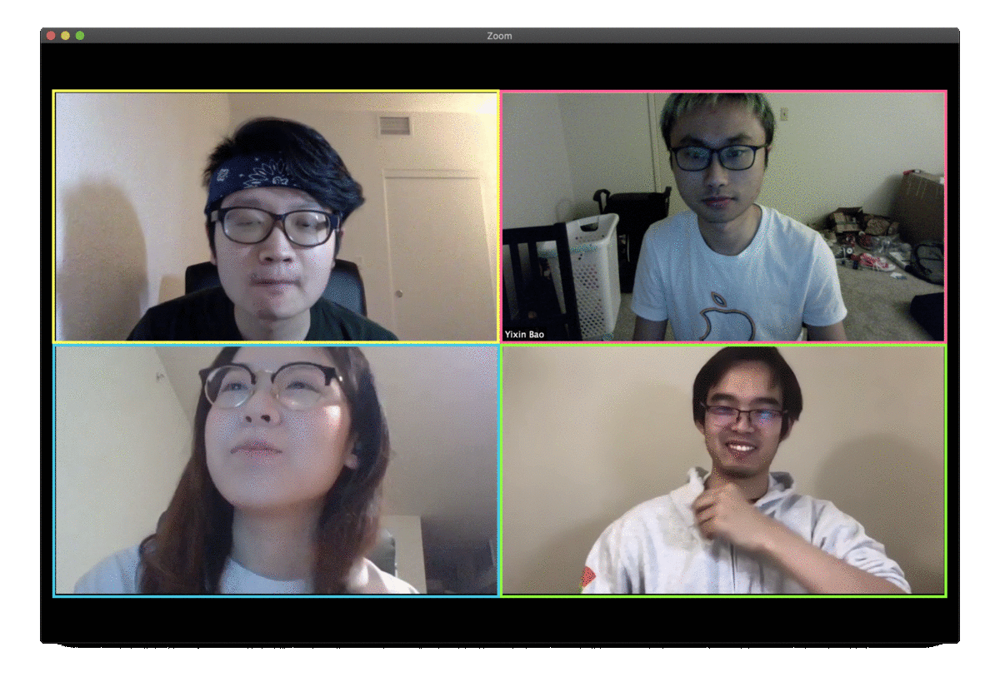

# MPS: Multi-Person Shopping for Cashier-Less Store
This project shares our solution for AiFi's CPS-IoT Autocheckout [Competition](https://www.aifi.io/research). `We're the winner: Team 3!`
- Authors: [Yixin Bao](https://www.linkedin.com/in/yixinbao/), [Xinyue Cao](https://www.linkedin.com/in/xinyuecao/), [Chenghui Li](https://www.linkedin.com/in/leochli/), [Mengmeng Zhang](https://www.linkedin.com/in/zhangmengmeng/)
- Affiliation: Carnegie Mellon University, U.S.

## Demo

```
============= Our Predicted Receipt  =============
Customer ID: 14322669897997084492

Purchase List: 
9 x Boomchickapop Sweet & Salty Kettle Corn
6 x Boomchickapop Sea Salt Popcorn
6 x Skinnypop Popcorn

F1-score: 97.6%
```

## Installation
- Install and start [mongodb](https://docs.mongodb.com/manual/tutorial/install-mongodb-on-ubuntu/) in order to store the test case data
```
sudo systemctl start mongod
```
- Install dependencies
```
pip3 install -r requirements.txt
```

## Sample Data

- Download Videos [Here](https://storage.googleapis.com/aifi-public-data/AiFi%20Nanostore%20AutoCheckout%20Competition%20-%20CPS-IoT%20Week%202020/cps-test-01/cps-test-videos.gz) (17.1MB)

- Download Data without Depth Images [Here](https://storage.googleapis.com/aifi-public-data/AiFi%20Nanostore%20AutoCheckout%20Competition%20-%20CPS-IoT%20Week%202020/cps-test-01/cps-test-01-nodepth.archive) (239MB)

- Download Data with Depth Images [Here](https://storage.googleapis.com/aifi-public-data/AiFi%20Nanostore%20AutoCheckout%20Competition%20-%20CPS-IoT%20Week%202020/cps-test-01/cps-test-01-all.archive) (2.0GB)

- The complete public datasets available at http://aifi.io/research under Sample Data.

- To import the data into mongodb: 
```
mongorestore --archive="cps-test-01-nodepth.archive"
```

## Get started
To test one single testcase:
```python
python3 test.py
```
To get more detaild log, change in `config.py`:
```bash
VERBOSE = 1
```
To test it against the competition API:
```
python3 submit.py
```

## Ground truth
For most of testcases in public dataset and the competition datast, we have manually labeled the [ground truth](https://github.com/AutoCheckout-CMU/AutoCheckout/tree/master/ground_truth). 

To get a F1-score out of the ground truth, modify the main function in `evaluation.py` to include your target database, then:

```
python3 evaluation.py
```
## Documentation & Benchmark Results
If you're interested in our methodologies and benchmark results, please refer to our
[Report](https://github.com/AutoCheckout-CMU/AutoCheckout/tree/master/doc/Multi_Person_Shopping.pdf).

## Our team


## Citing MPS
If you use MPS in your research or wish to refer to the baseline results published in [Report](https://github.com/AutoCheckout-CMU/AutoCheckout/tree/master/doc/Multi_Person_Shopping.pdf), please use the following BibTeX entry.

```BibTeX
@unpublished{MPS2020,
  author = {Yixin Bao, Xinyue Cao, Chenghui Li, Mengmeng Zhang},
  title = {Multi-Person Shopping (MPS) for Cashier-Less Store},
  school = {Carnegie Mellon University},
  year = {2020},
  note = {Unpublished: https://github.com/AutoCheckout-CMU/AutoCheckout}
}
